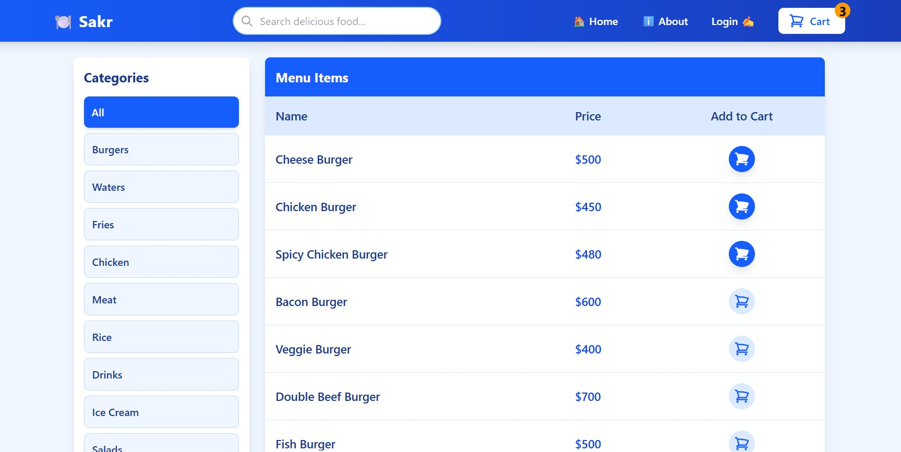
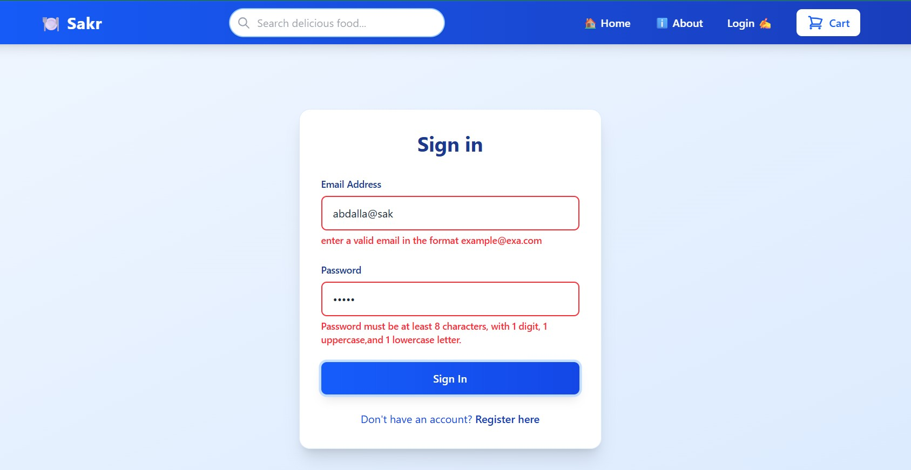
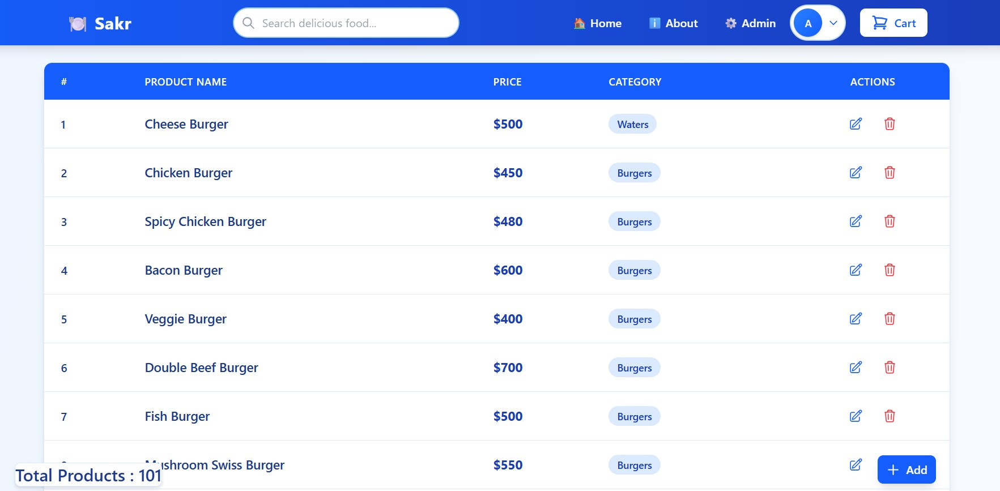
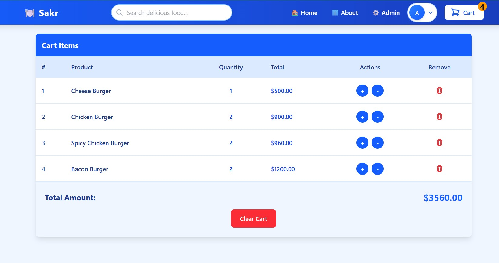

# 🍽️ Sakr Restaurant - React E-Commerce App

A simple full-stack restaurant web app built with **React** and **JSON Server**. This app supports authentication (user/admin),      
item listing with filtering, search, pagination, shopping cart functionality, and an admin panel for managing products.

---

## 🌐 Live Demo# 🍽️ Sakr Restaurant - Full-Stack React App

A modern and responsive restaurant web application built with **React** and **TailwindCSS**, using **JSON Server** and **json-server-auth** as a mock backend for authentication and data storage.

---

- 🔗 **GitHub Repository**: [https://github.com/abdallaskar/sakrResturnt](https://github.com/abdallaskar/sakrResturnt)

---

## 🎥 YouTube Videos

- 📺 [Video 1 – Full App Demo (Pages Overview)](https://www.youtube.com/watch?v=dkXBIC_2H-8)
- 📺 [Video 2 – Code Walkthrough & Explanation](https://www.youtube.com/watch?v=MRw4ayk3IMM)

---

## 🧰 Tech Stack

| Tech                | Description                      |
|---------------------|----------------------------------|
| React 19            | Frontend framework               |
| React Router v7     | SPA navigation                   |
| TailwindCSS & DaisyUI | Utility-first CSS + UI components |
| JSON Server         | Mock RESTful backend             |
| json-server-auth    | Simple role-based authentication |
| Formik              | Form handling and validation     |
| React Toastify      | Notifications                    |
| Lucide React        | Icon library                     |

---

## ✨ Features

### 👥 Authentication
- Register and Login for users and admins
- JWT-based authentication via `json-server-auth`

### 🛍️ Users
- View item list with:
  - 🔍 Search
  - 🧮 Pagination
  - 🧩 Category filtering
- Add items to cart
- Update quantity (+ / -)
- Delete items from cart
- View total amount

### 🛠️ Admin
- Admin panel with full CRUD operations:
  - ➕ Add new items
  - ✏️ Edit items
  - 🗑️ Delete items

### 📄 Pages
- Home
- About
- Register
- Login
- Items List
- Cart
- Admin Dashboard

---

## 📷 Screenshots

> Add screenshots in the `screenshots/` folder and update the paths below.











---

## 📁 Project Structure

```bash
sakrResturnt/
├── client/         # React frontend
│   ├── src/
│   └── public/
├── server/         # JSON server backend
│   └── db.json
└── README.md
